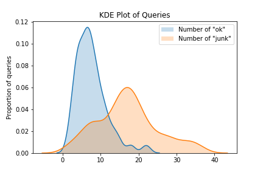

# Tokyo 24/7 Image Retrieval Annotations

## Introduction

To help visual-geolocalization research, we publish a subset of manually annotated Tokyo 24/7 Google Street View Dataset originally released by Torii *et al* [[1]](#1).  There are no explicit ground truths provided in the dataset, and generally the provided GPS locations are used to select ground truths for image retrieval applications. 

In this work, we annotate a subset of the original Tokyo 24/7 Dataset following a similar convention as Oxford5k [[2]](#2) and Paris6k [[3]](#3) datasets.  The annotated subset consists of 16,000 dataset images and 49 distinct query locations taken at day/evening/night, resulting in a total of 147 query images.

## Annotation Process

1. The query subset used in [[1]](#1) was used as the base. The csv files were collated into one large csv file so the number of queries in each easting could be determined.
2. The top three eastings with the most query images were picked: 03819XX, 03821XX, 03822XX, and a query-csv specific to each easting was generated. This csv contains the coordinates of each image.
3. image-csv's were then generated for the dataset images within these three eastings.
4. By comparing the coordinates between query and dataset images of the same easting, .txt files containing potential positives for each query are generated.
5. The .txt files are manually reviewed and annotated to determine positives and junks.

## Annotation Details

| File Name               | Details                                                      |
| ----------------------- | ------------------------------------------------------------ |
| <query_number>.txt      | Contains filenames of dataset images of the same easting to 4 significant figures (*i.e. :* 03821XX), that are within 25 meters of <query_number>.jpg |
| <query_number>_ok.txt   | `ok` indicates images where more than 25% of a distinct object is clearly visible, or Intersection over Union is approximately more than 25%. This annotation is performed on the dataset images from <query_number>.txt above. |
| <query_number>_junk.txt | `junk` indicates images where less than 25% of a distinct object is clearly visible, or Intersection over Union is approximately less than 25%. This annotation is performed on the dataset images from <query_number>.txt above. |

## Annotation Statistics

We provide some basic statistics of the resulting annotations.

| Statistic                                         | Details |
| ------------------------------------------------- | ------- |
| Number of Unique Geo-locations                    | 49      |
| Number of Queries per geo-location/ Total Queries | 3 / 147 |
| Total number of subset images                     | 16000   |

We also show the distribution of **ok** and **junk** annotations below. More details and statistics regarding the dataset can be found in the original paper [[1]](#1).

## Using the Annotations

- All annotations (txt files) can be found under */gt*. 

- Source code can be found at */src*.

Do note that we only publish the annotations and not the actual data. Please contact the original author Relja Arandjelovic (relja@relja.info) to access the Tokyo 24/7 Google Street View dataset.

## Generate your own annotations

Ensure all path arguments are set correctly in all the scripts before running. 

- `readallquerycsv.py` reads all csv files in the folder (and subfolders) and collates the image name and coordinates into one `output.csv`. 
  This allows the user to sort the list by easting and extract all queries of the same easting.

- `readquerycsv_<easting>.py` can used in a folder that contains only queries of one easting to generate `queryinfo_<easting>.csv`.

- `readimgcsv_<easting>.py` can be used in a folder that contains dataset images of one easting to generate `imginfo_<easting>.csv`. It is also slightly modified as dataset csvs are differently formatted from query csvs.

- `generateGT_<easting>.py` uses `queryinfo_<easting>.csv` and `imginfo_<easting>.csv` to generate `<query_number>.txt` files.
  Use these files to manually label the corresponding images as `ok` and `junk`  to create your own annotations. 

## Acknowledgements

This work was done by Jeremy Ngo (Engineering Systems Design) during his internship at [Temasek Laboratories, Singapore University of Technology and Design](https://temasek-labs.sutd.edu.sg/) (Jun 2020- Aug 2020). Please contact him at jeremy_ngo@mymail.sutd.edu.sg regarding any further questions. 

## References

<a id="1">[1]</a> A. Torii, R. Arandjelović, J. Sivic, M. Okutomi and T. Pajdla, "24/7 place recognition by view synthesis," 2015 IEEE Conference on Computer Vision and Pattern Recognition (CVPR), Boston, MA, 2015, pp. 1808-1817, doi: 10.1109/CVPR.2015.7298790.

<a id="2">[2]</a> J. Philbin, O. Chum, M. Isard, J. Sivic and A. Zisserman, "Object retrieval with large vocabularies and fast spatial matching," 2007 IEEE Conference on Computer Vision and Pattern Recognition, Minneapolis, MN, 2007, pp. 1-8, doi: 10.1109/CVPR.2007.383172.

<a id="3">[3]</a> J. Philbin, O. Chum, M. Isard, J. Sivic and A. Zisserman, "Lost in quantization: Improving particular object retrieval in large scale image databases," 2008 IEEE Conference on Computer Vision and Pattern Recognition, Anchorage, AK, 2008, pp. 1-8, doi: 10.1109/CVPR.2008.4587635.

